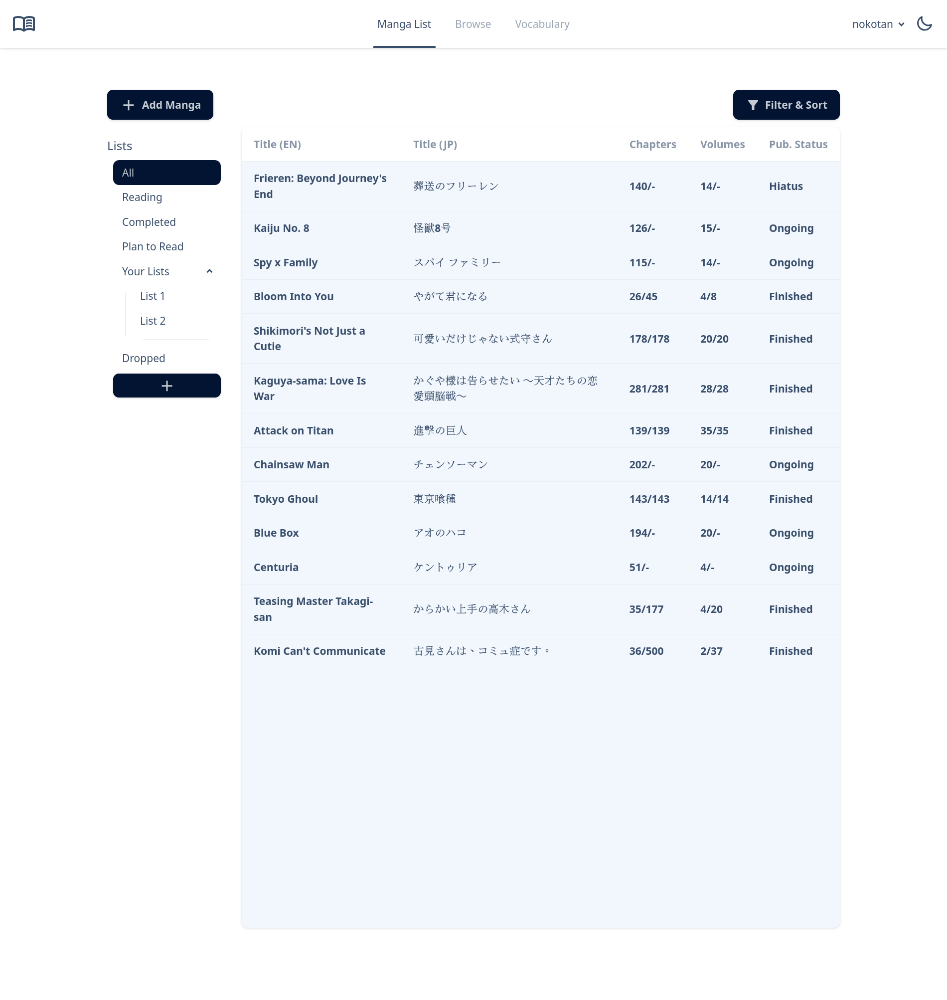
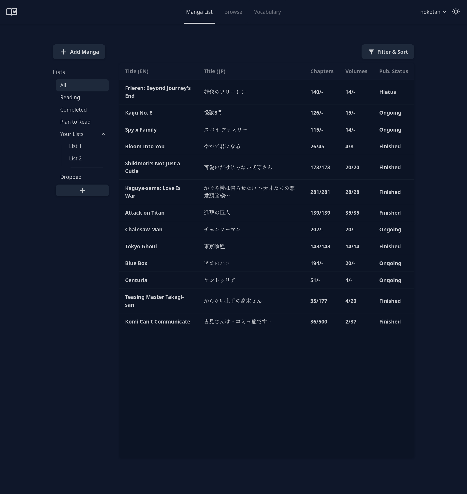
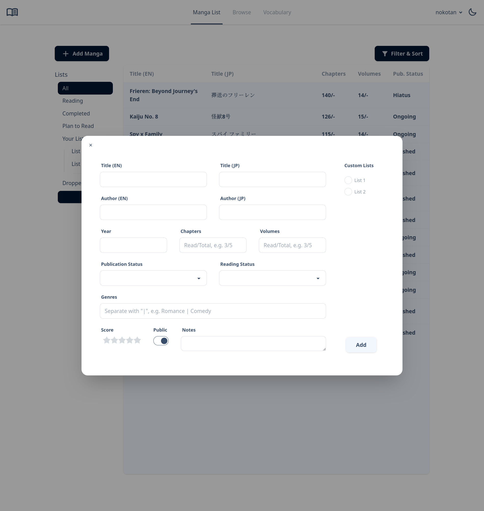
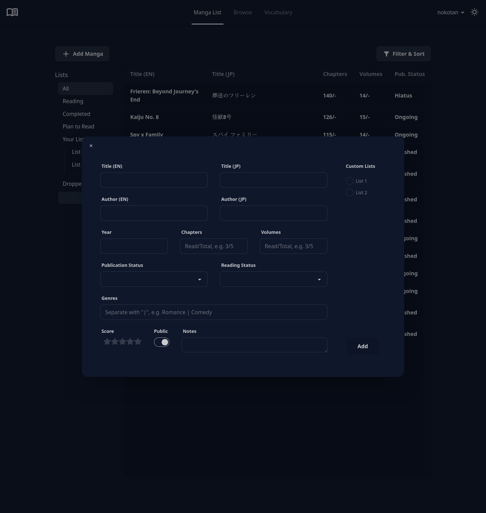
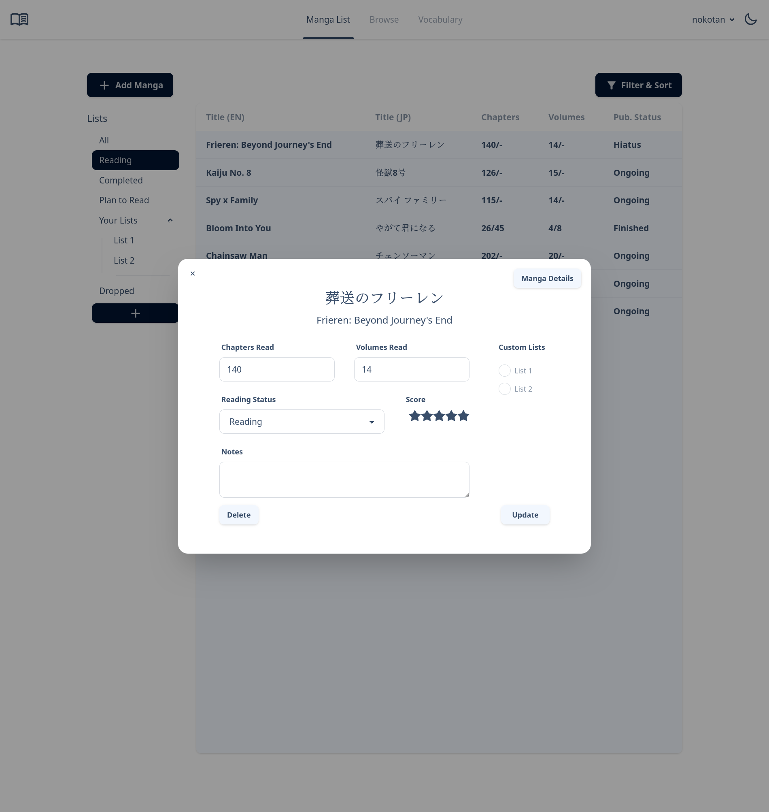
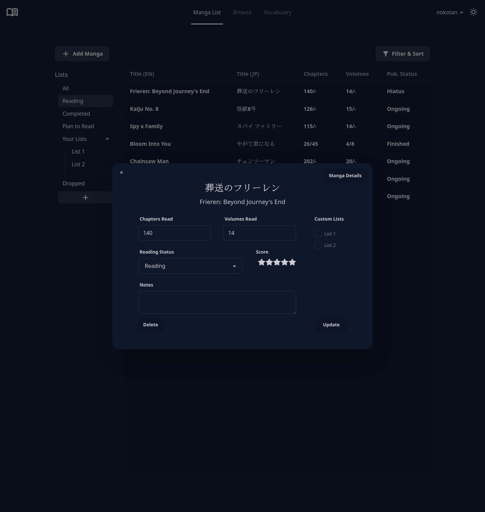

# Manga Tracker

Web app for tracking manga reading progress. Name TBD.

This repository contains the frontend. The backend can be found [here](https://github.com/nokotan8/manga-tracker-api)

> [!IMPORTANT]
> This project is 1. for fun and 2. a work in progress. Do not be surprised if something breaks.

## Features

- Add manga into default and custom reading lists
- Edit all entered information such as read and total chapters/volumes, useful for ongoing series
- Also includes some other fields that might be useful, and a notes section for any additional info you want to track
- Authentication/authorization with JWTs so other people can't see the embarrassing romance manga you're reading
- Dark mode toggle for vampires

## Usage

1. Follow the setup instructions for the [API](https://github.com/nokotan8/manga-tracker-api).
1. Clone this repo:

```bash
git clone --depth 1 https://github.com/nokotan8/manga-tracker
```

3. Install dependencies and run the server on `localhost:9291`:

```bash
npm install
npm run dev
```

- Optionally, you can change the port by editing `vite.config.ts`

## Screenshots

| Light Mode | Dark Mode |
| :------------------------------------------------------: | :--------------------------------------------------: |
| List View  | List View  |
| Add Manga  | Add Manga  |
| Edit Manga  | Edit Manga  |

## Todo

- [x] Basic manga add/edit functionality
- [x] Basic list add functionality
- [ ] Sorting and filtering functionality (in development)
- [ ] Manga and list delete functionality (in development)
- [ ] Profile information and customisation
- [ ] Public sharing of selected manga/lists/profile information
- [ ] Vocabulary tracking for language learners
